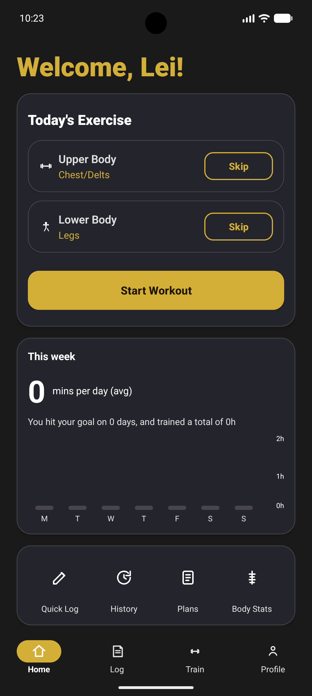
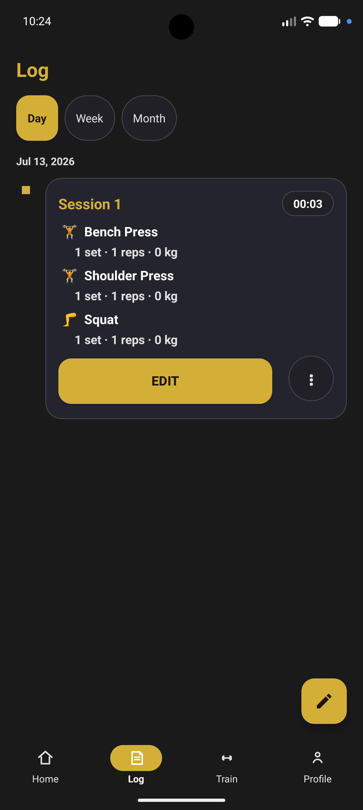
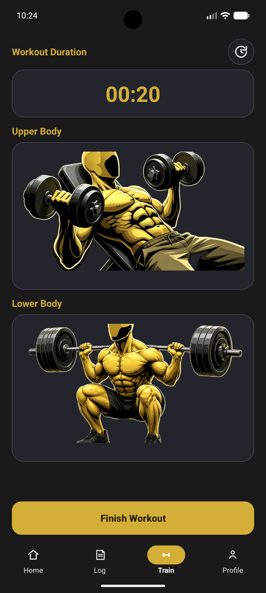
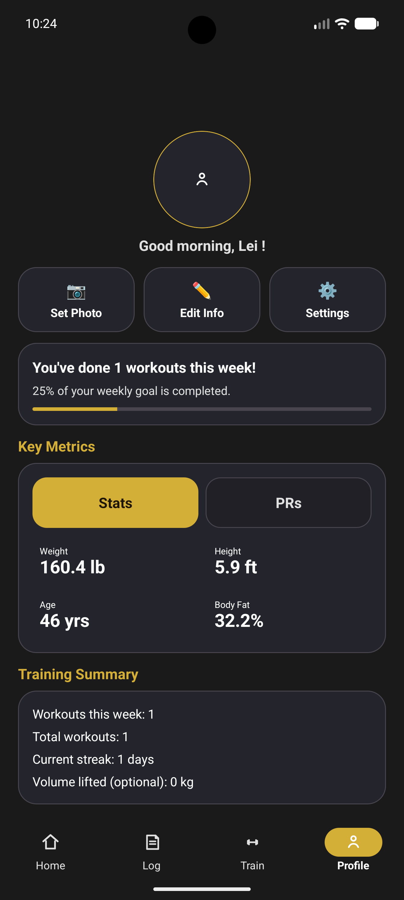

# Jeanetix

### Smart Gym Journal — Android Workout Tracker with AI Pose Detection

[](https://www.android.com/)
[](https://dotnet.microsoft.com/)
[](https://github.com/Puddl3Jumper/GYM_Log_App/releases/latest)
[](LICENSE)

---

## Table of Contents

- [Overview](#overview)
- [Technology Stack](#technology-stack)
- [Key Features](#key-features)
- [Screenshots](#screenshots)
- [Installation](#installation)
- [Building from Source](#building-from-source)
- [Project Structure](#project-structure)
- [License](#license)

---

## Overview

**Jeanetix** is an open-source Android gym journal application built with .NET 10 for Android.
It combines traditional workout logging with intelligent features — AI-powered pose detection,
geofence-based gym arrival reminders, cloud sync, and a built-in workout rotation planner —
all wrapped in a clean Material Design 3 interface.

### Key Benefits

- **AI Pose Detection** — Real-time rep counting via MediaPipe pose landmark analysis
- **Smart Reminders** — Geofence-triggered notifications when you arrive at the gym
- **Cloud Sync** — Workout history synced to Firebase Firestore across devices
- **Rotation Planner** — Automated upper/lower body split scheduling
- **Guest & Account Modes** — Use locally or sign in with email / Google

> **Note:** Jeanetix is an independent personal project and is not affiliated with any gym or fitness brand.

---

## Technology Stack

| Layer | Technology |
|---|---|
| Language | C# (.NET 10) |
| UI | Android Native (AXML layouts, Material Design 3) |
| Pose Detection | MediaPipe Tasks Vision 0.10 |
| Backend / Auth | Firebase Authentication + Firestore |
| Local Storage | JSON serialization (app-local data directory) |
| Build | MSBuild / `dotnet build` |
| IDE | Visual Studio / VS Code + .NET Android Workload |

---

## Key Features

### Workout Logging

| Feature | Description |
|---|---|
| 🏋️ New Workout Sessions | Start a timed session with automatic duration tracking |
| ➕ Exercise Selection | Pick from 15+ pre-defined exercises or add custom ones |
| 🔁 Circuit Support | Group exercises into named circuits with loop/round tracking |
| 📋 Set Recording | Log reps and weight for every set in real time |
| ▶️ Resume Workouts | Continue an in-progress session after closing the app |
| 📚 Exercise Library | Browse exercises organized by muscle group; add custom entries |

### Intelligence & Automation

| Feature | Description |
|---|---|
| 🤖 AI Rep Counting | MediaPipe pose landmark model detects movement loops via camera |
| 📍 Gym Geofence | Arrival/departure notifications using background location geofencing |
| 🔔 Smart Reminders | Scheduled and boot-persistent workout reminders |
| 🔄 Rotation Planner | Automated upper/lower body day rotation with skip support |
| 📈 Progress Dashboard | Weekly training chart with averages and insights on the home screen |

### Account & Sync

| Feature | Description |
|---|---|
| 🔐 Firebase Auth | Email/password and Google Sign-In via Firebase Identity Platform |
| ☁️ Cloud Sync | Push/pull workout history to Firestore with debounced background sync |
| 👤 Guest Mode | Full local functionality without requiring an account |
| ⚙️ Auth Server | Companion ASP.NET Core token-exchange server (`FirehoseAuthServer`) |

### Customization

| Feature | Description |
|---|---|
| 🎨 Theme Support | Light / Dark / System-default theme switching |
| 📊 History View | Review all completed workouts with sets, reps, circuits, and duration |
| 🏃 Profile & Settings | User profile editing and app preferences |

---

## Screenshots

| Home | Log | Train | Profile |
|:---:|:---:|:---:|:---:|
|  |  |  |  |

---

## Installation

### System Requirements

| Requirement | Minimum |
|---|---|
| Operating System | Android 7.0 (API 24) |
| Storage | ~25 MB |
| Permissions | Camera, Location (geofence), Notifications |
| Network | Optional (required for cloud sync) |

### Install from Releases

1. Go to the [Releases](../../releases) page on GitHub.
2. Download the latest `Gym_App-signed-latest.apk`.
3. Enable **Install from unknown sources** in your device security settings.
4. Open the APK to install.

> **Security Notice:** Only install APKs from this repository's official Releases page.

---

## Building from Source

### Prerequisites

| Tool | Version | Purpose |
|---|---|---|
| .NET SDK | 10.0+ | Runtime and build toolchain |
| .NET Android Workload | 10.0+ | Android target support |
| Java JDK | 21 | Android build tools |
| Android SDK | API 34+ | Android platform tools |
| VS Code or Visual Studio | Latest | IDE |

### Setup

```bash
# Clone the repository
git clone https://github.com/Puddl3Jumper/GYM_Log_App.git
cd GYM_Log_App

# Install .NET Android workload (if not already installed)
dotnet workload install android

# Restore NuGet packages
dotnet restore Gym_App/Gym_App/Gym_App.csproj
```

### Build

```bash
# Debug build
dotnet build Gym_App/Gym_App/Gym_App.csproj -c Debug

# Release APK
dotnet publish Gym_App/Gym_App/Gym_App.csproj -c Release -f net10.0-android
```

### Run on Device / Emulator

```bash
# List connected devices
adb devices

# Deploy and launch (replace <device-id> as needed)
dotnet build Gym_App/Gym_App/Gym_App.csproj -c Debug -t:Install -p:AdbTarget=-s\ <device-id>
```

> **Note:** A `google-services.json` file with your own Firebase project configuration is required for authentication and cloud sync to work.

---

## Project Structure

```
GYM_Log_App/
├── Gym_App/
│   └── Gym_App/
│       ├── Activities/          # Android Activity screens
│       │   ├── HomeActivity.cs          # Dashboard with rotation plan & weekly chart
│       │   ├── WorkoutActivity.cs       # Active workout logging
│       │   ├── ExerciseLibraryActivity.cs
│       │   ├── HistoryActivity.cs
│       │   ├── ProgressActivity.cs
│       │   ├── ProfileActivity.cs
│       │   ├── SettingsActivity.cs
│       │   ├── LoginActivity.cs
│       │   └── CreateAccountActivity.cs
│       ├── Models/              # Data models
│       │   ├── Exercise.cs
│       │   ├── WorkoutSession.cs
│       │   ├── WorkoutExercise.cs
│       │   └── WorkoutSet.cs
│       ├── Data/                # Persistence & cloud
│       │   ├── GymDatabase.cs           # Local JSON data store
│       │   ├── FirebaseAuthService.cs   # Firebase Identity Platform client
│       │   ├── WorkoutCloudSyncService.cs
│       │   ├── AuthCredentialStore.cs
│       │   └── AuthSessionStore.cs
│       ├── Services/            # Background & intelligence
│       │   ├── CameraLoopDetection.cs   # AI rep-counting via MediaPipe
│       │   ├── GymProximity.cs          # Geofence gym-proximity logic
│       │   ├── ReminderScheduler.cs
│       │   └── ReminderService.cs
│       ├── Receivers/           # Android broadcast receivers
│       │   ├── GymGeofenceReceiver.cs
│       │   ├── GymGeofenceBootReceiver.cs
│       │   └── ReminderReceiver.cs
│       └── Resources/           # Layouts, drawables, strings
├── FirehoseAuthServer/          # ASP.NET Core auth token server
└── Gym_App.Tests/               # Unit tests
```

---

## License

Copyright © 2026 Lei Yu

This project is licensed under the [MIT License](LICENSE).

---

_Built with passion for fitness and clean code._
